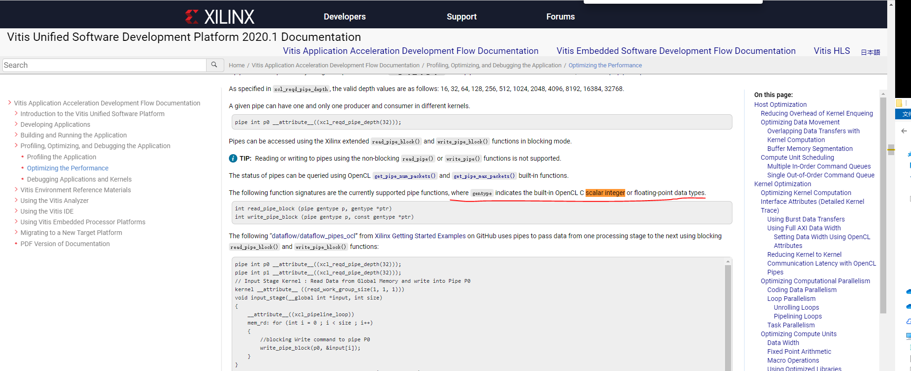

# PipeCNN
2020年新工科联盟-Xilinx暑期学校（Summer School）项目

使用Vitis对王东老师的PipeCNN进行实现，现在性能不理想，调通之后会merge到王老师的工程里

## 注意：

Xilinx的通过pipe传输数据，只支持标量数据https://www.xilinx.com/html_docs/xilinx2020_1/vitis_doc/optimizingperformance.html?hl=read_pipe_block

为了能够使用Pipe传递数据，写了几个版本的pipe_gen