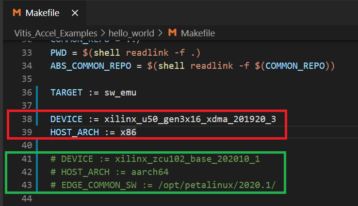

## 简略使用指南：

1. 服务器:50   用户：user2 

2. cd /home/user2/workspace/

   可以看到在workspace目录下存在着setVitis2019.sh，setVitis2020arm.sh，setVitis2020x86.sh等等环境变量配置脚本，通过source这些环境配置文件**之中的一个**，就可以配置好相应的环境，如果只进行仿真这里建议**source setVitis2020x86.sh**。

   

3. source setVitis2020arm.sh (嵌入式板)  或者  source setVitis2020x86.sh (PCIE板)

| 脚本                   | 特性                                                         |
| ---------------------- | ------------------------------------------------------------ |
| setVitis2019.sh        | 使用Vitis2019.2（不推荐，太长时间没用了，怕有bug）           |
| setVitis2020arm.sh     | 使用Vitis2020.1  用于仿真、综合嵌入式FPGA板卡，**但仿真时会调用Arm模拟器，速度极慢，不推荐用于软仿** |
| **setVitis2020x86.sh** | 使用Vitis2020.1  用于仿真、综合PCIE板卡，**在没有PCIE板卡的情况下可以软仿，仿真速度快，软仿时推荐** |

4. 命令行编译方法：

   1. cd /home/user2/workspace/Vitis_Accel_Examples/hello_world/

   2. make cleanall

   3. make all   （目前设置为软仿，可以进入Makefile中修改，**目前选中的是红框中的配置（软仿推荐配置）**，如果想对嵌入式板子进行编译，可以选中绿色框中的内容）

      

   4. make test（进行仿真）

5. GUI工程创建（正在写）

   1.  远程桌面连接服务器， source setVitis2020x86.sh

   2.  在终端中输入vitis，之后会让你选择workspace，你想在哪里建立工程就选在哪里，我这里面选了我的目录下，点Launch

      

   3.  如果该workspace下面没有之前创建的工程，Vitis会显示如下的空白workspace

      

   4. 点击上图中的**Create Application Project**即可创建工程（其余的几个选项是用来创建BSP的，咱们用不到）。弹出如下对话框，点击Next
   
      
   
   5. 选择平台，咱们先以软仿为主，为了快速仿真咱们使用U50板卡
      
      
      
   6. 为工程起个名字
   
      
   
   7. 这里会有赛灵思提供的官方示例，咱们选一个OpenCL的Hello World，点Finish
   
      
   
   8. 会看到示例工程就建好了，在左上的Explorer栏中会显示出当前目录下的两个工程即刚刚建立的hello_world_system和之前创建的pipecnn-vitis_system，展开src文件夹可以看到源文件。
   
      
   
   9. 软仿步骤1，编译：右击Assistant栏中的Emulation-SW选择build
   
      
   
      编译好啦
   
      
   
   10. 软仿步骤2，运行软仿：右击Assistant栏中的Emulation-SW选择Run
   
       
   
   11. 启动Timeline在Assistan栏下展开Emulation-SW，双击Run Summary
   
       
   
   12. 打开的Timeline如下图
   
       
   
   13. a

## 嵌入式仿真注意：

下面的配置已经完成，但是如果您从Xilinx的github**新拉一个Vitis_Accel_Examples仓库后，需要留意一下步骤1.2**

1. ~~Vitis2020开始在嵌入式平台仿真时，调用了**Perl语言**的脚本，即Vitis_Accel_Examples/common/utility/run_emulation.pl，所以先要装Perl。[（Xilinx What‘s New）](https://www.xilinx.com/html_docs/xilinx2020_1/vitis_doc/drr1589984778785.html?hl=perl)~~
    ~~1.1 Perl模块的安装：run_emulation.pl脚本调用了Expect模块，这个模块默认没有安装，参考[安装方法](https://www.cnblogs.com/xianguang/p/9845375.html)中自动安装方式，cpan -i Expect即可。~~
    1.2 修改仿真脚本的**解释器路径**：将Vitis_Accel_Examples/common/utility/run_emulation.pl这个脚本的**解释工具改为机器的Perl安装路径**，即将run_emulation.pl的第一行#!/tools/xgs/perl/5.8.5/bin/perl改为#!/usr/bin/perl。

